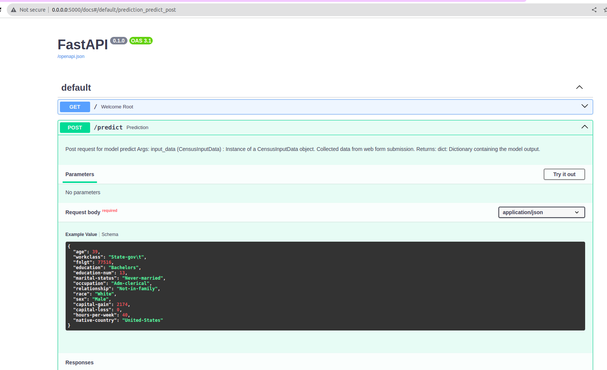
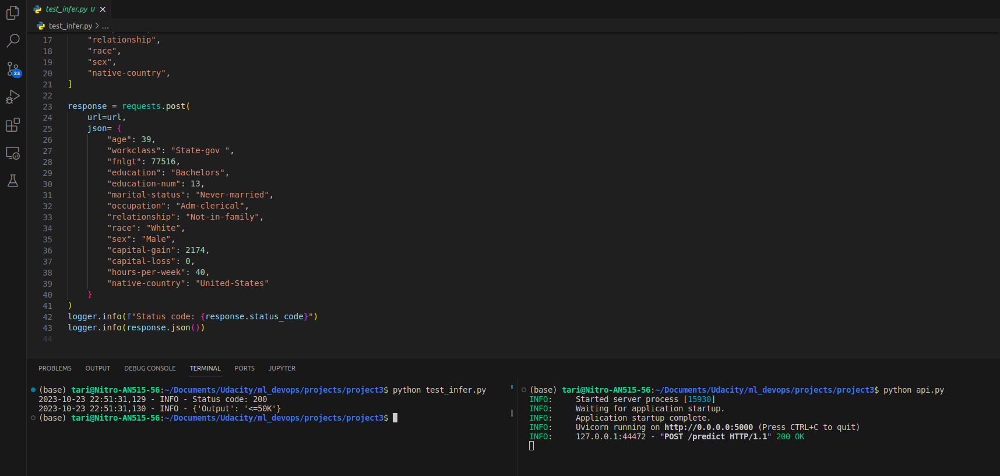

# Deploying a ML Model to Cloud Application Platform with FastAPI
## Project Descriptions
Using all skills actuired for data Census Bureau. Create unitest and monitor the model perfomance. Using FastAPI and create API tests.
CI/CD using github action.

```
tree .

.
├── api.py
├── artifact
│   ├── dataset
│   │   ├── census_clean.csv
│   │   ├── census_clean.csv.dvc
│   │   ├── census.csv
│   │   └── census.csv.dvc
│   └── models
│       └── lr_model.pkl
├── configs.yaml
├── core
│   ├── data.py
│   ├── model.py
│   ├── __pycache__
│   │   ├── data.cpython-311.pyc
│   │   ├── model.cpython-311.pyc
│   │   └── train.cpython-311.pyc
│   └── train.py
├── Dockerfile
├── EDA.ipynb
├── images
│   ├── fastapi.png
│   └── test_infernce.png
├── outputs
│   ├── 2023-10-21
│   │   └── 16-07-23
│   │       └── train.log
│   ├── 2023-10-22
│   │   └── 00-28-03
│   │       └── train.log
│   └── 2023-10-23
│       ├── 22-32-01
│       │   └── train.log
│       └── 22-33-10
│           └── train.log
├── __pycache__
│   ├── api.cpython-311.pyc
│   └── test_infer.cpython-311-pytest-7.4.0.pyc
├── readme.md
├── requirements.txt
├── sanity_checks.py
├── slice_output.txt
├── test_infer.py
├── tests
│   ├── __pycache__
│   │   ├── test_api.cpython-311-pytest-7.4.0.pyc
│   │   └── test_model.cpython-311-pytest-7.4.0.pyc
│   ├── test_api.py
│   └── test_model.py
└── train.py

17 directories, 33 files
```

[Link github](https://github.com/ndtands/mldevops_project3.git)

### 1. Setup
```
pip install -r requirements.txt
pip install dvc
```

### 2. Data
```
artifact/dataset/census.csv
```
Download data: [Here](https://archive.ics.uci.edu/ml/datasets/census+income)

### 3. EDA
EDA in notebook: [Here](EDA.ipynb)

### 4. Data versioning
```
dvc init
mkdir ../local_remote
dvc remote add -d localremote ../local_remote
dvc add artifact/dataset/census.csv
dvc add artifact/dataset/census_clean.csv
git add artifact/dataset/.gitignore data/census.csv.dvc artifact/dataset/census_clean.csv.dvc
git commit -m "Add dataset"
dvc push
```

### 5. Train model
```
python train.py


# Output
[2023-10-23 22:33:10,322][core.train][INFO] - Hydra config: {'main': {'cat_features': ['workclass', 'education', 'marital-status', 'occupation', 'relationship', 'race', 'sex', 'native-country'], 'num_features': ['age', 'fnlwgt', 'education-num', 'capital-gain', 'capital-loss', 'hours-per-week'], 'label': 'salary', 'model_path': 'artifact/models/lr_model.pkl', 'slice_output_path': 'slice_output.txt', 'data_path': 'artifact/dataset/census_clean.csv', 'test_size': 0.2, 'folder_path_model': 'artifact/models'}}
[2023-10-23 22:33:10,323][core.train][INFO] - Reading data...
[2023-10-23 22:33:10,377][core.train][INFO] -                 age         fnlgt  education-num  capital-gain  capital-loss  hours-per-week
count  32537.000000  3.253700e+04   32537.000000  32537.000000  32537.000000    32537.000000
mean      38.585549  1.897808e+05      10.081815   1078.443741     87.368227       40.440329
std       13.637984  1.055565e+05       2.571633   7387.957424    403.101833       12.346889
min       17.000000  1.228500e+04       1.000000      0.000000      0.000000        1.000000
25%       28.000000  1.178270e+05       9.000000      0.000000      0.000000       40.000000
50%       37.000000  1.783560e+05      10.000000      0.000000      0.000000       40.000000
75%       48.000000  2.369930e+05      12.000000      0.000000      0.000000       45.000000
max       90.000000  1.484705e+06      16.000000  99999.000000   4356.000000       99.000000
[2023-10-23 22:33:10,385][core.train][INFO] - Splitting data...
[2023-10-23 22:33:10,390][core.train][INFO] - Processing data...
[2023-10-23 22:33:10,485][core.train][INFO] - Training model...
[2023-10-23 22:33:10,651][core.train][INFO] - LogisticRegression(max_iter=1000, random_state=8071)
[2023-10-23 22:33:10,652][core.train][INFO] - Saving model...
[2023-10-23 22:33:10,652][core.train][INFO] - Model saved.
[2023-10-23 22:33:10,652][core.train][INFO] - Inference model...
[2023-10-23 22:33:10,653][core.train][INFO] - Calculating model metrics...
[2023-10-23 22:33:10,660][core.train][INFO] - >>>Precision: 0.71
[2023-10-23 22:33:10,660][core.train][INFO] - >>>Recall: 0.2672521957340025
[2023-10-23 22:33:10,660][core.train][INFO] - >>>F1: 0.3883318140382862
[2023-10-23 22:33:10,661][core.train][INFO] - Calculating model metrics on slices data...
[2023-10-23 22:33:11,530][core.train][INFO] - >>>Metrics with slices data:             feature      category  precision    recall        f1
0         workclass             ?   0.520000  0.302326  0.382353
1         workclass  Self-emp-inc   0.844444  0.339286  0.484076
2         workclass       Private   0.710526  0.267062  0.388210
3         workclass     Local-gov   0.730769  0.299213  0.424581
4         workclass     State-gov   0.833333  0.220588  0.348837
..              ...           ...        ...       ...       ...
96   native-country      Cambodia   0.000000  0.000000  1.000000
97   native-country          Hong   1.000000  1.000000  1.000000
98   native-country          Peru   1.000000  1.000000  1.000000
99   native-country          Laos   1.000000  1.000000  1.000000
100  native-country       Hungary   1.000000  1.000000  1.000000

[101 rows x 5 columns]
```

### 6. Unit Tests
```
pytest tests/

#Ouput
collected 8 items                                                                                                                                  

tests/test_api.py ....                                    [ 50%]
tests/test_model.py ....                                  [100%]
====================8 passed in 0.86s ==========================
```

### 7. Run sanity checks
```
python sanity_checks.py

```

### 8. Dockerize
```
docker build -t project3 .
docker run -p 5000:5000 project3

```

### 9. CI/CD

### 10. Request API
#### Local
```
python api.py
```

#### Test post
```
python test_infer.py
```


## Code Quanlity
### Style Guide
Format your refactored code using the PEP 8 – Style Guide. To help meet the PEP 8 guidelines, you can use autopep8 with the following command line commands:
```
autopep8 --in-place --aggressive --aggressive .
```

### Style Checking and Error Spotting
Utilize Pylint for code analysis to spot programming errors and areas that might benefit from further refactoring. Check the pylint score using the command below:
```
pylint -rn -sn .
```
